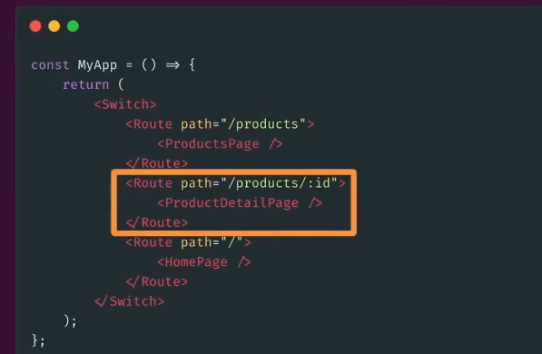

# nextjs

`nextjs对比react不同`

1. 基础的react在查看浏览器源码时，只会返回一个原始的HTML骨架，在next中，返回的HTML是一个非骨架HTML文件
   
2. 上图所示，两个框架返回的HTML文件，在搜索引擎爬虫时，next显然更有利于爬虫爬取
3. 在路由方面，常规的React需要我们去编写路由代码，在next中，路由根据文件会自动生产
4. 在渲染方面，react在客户端渲染，通常页面展示后调用服务器端接口返回数据，期间用户看到的页面将是不完整的，而next框架有渲染的功能，在服务端拿到数据后返回HTML文件
5. Next可以通过node访问一些服务器端的API
6. 在框架生成时，react的public会有index.html,而Nest没有，当请求达到服务器时，（单个页面动态渲染）服务器渲染和页面的预渲染

## 路由

`与react路由的不同`
在React，我们需要编写一些路由的代码

而next使用基于文件系统的路由，文件夹用于定义路由

page.js为该文件夹默认访问的路由，若文件没有page.js，则该路径公开不可访问

### 静态，动态路由

`静态路由`

根据文件夹默认访问的路由
`动态路由`

动态路由：当不知道确切的名称并想要从动态数据创建路由时，可以使用动态路由，例如（商品详情，但不知道是那个商品详情）

当一个文件夹下（上图）创建了两个动态路由，控制台将会提示报错Failed to reload dynamic routes: Error: You cannot use different slug names for the same dynamic path ('id' !== 'a') ， 在同一文件夹最多只有一个动态路由且可选路由是最后一段

动态路由有可选的catch-all段，在表达上使用`[[...folderName]]`表示,与`[...folderName]`的区别是前者在访问没有参数的路由也会匹配，例如
app/shop/[...slug]/page.js 和 app/shop/[[...slug]]/page.js 前者在访问 /shop时会404 ， 后者可以匹配到/shop页面

`路由跳转API`：https://nextjs.org/docs/app/building-your-application/routing/linking-and-navigating

